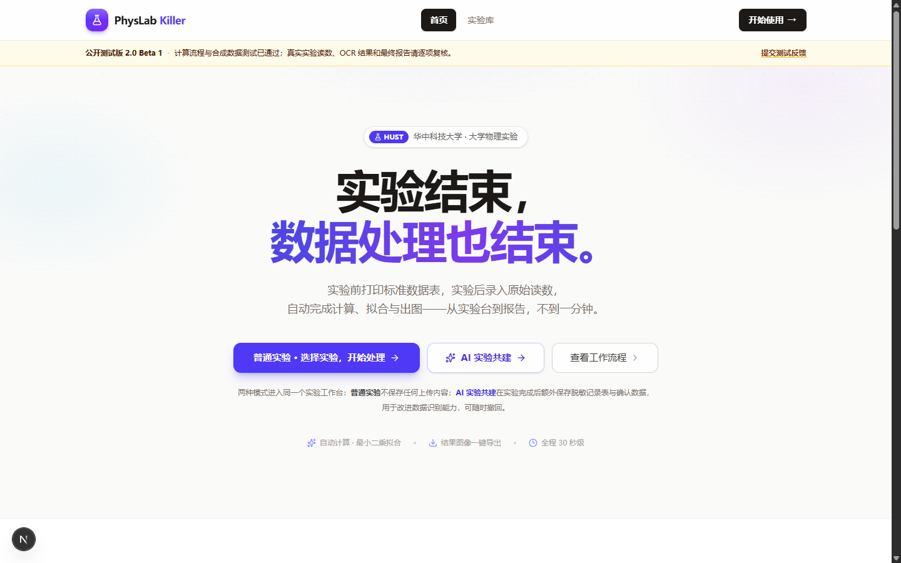
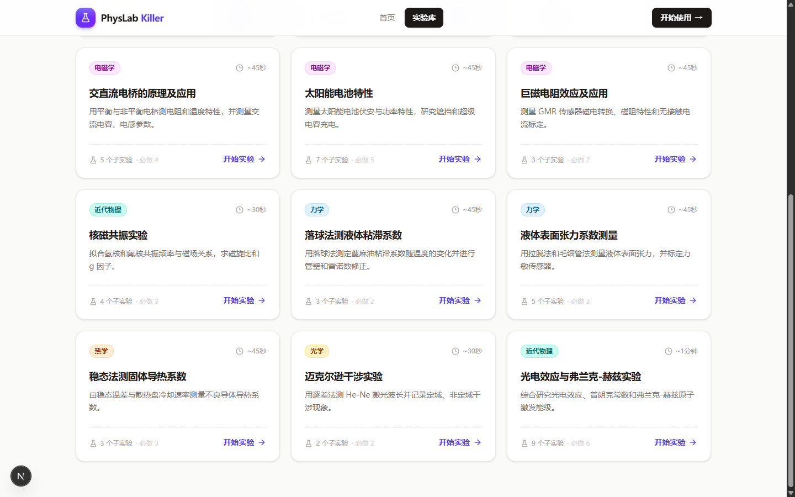
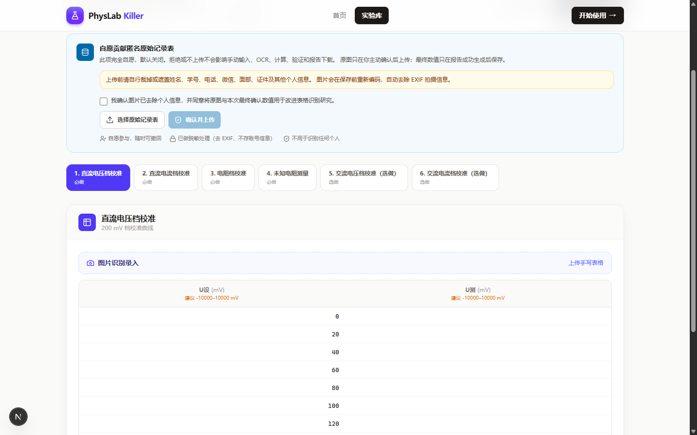
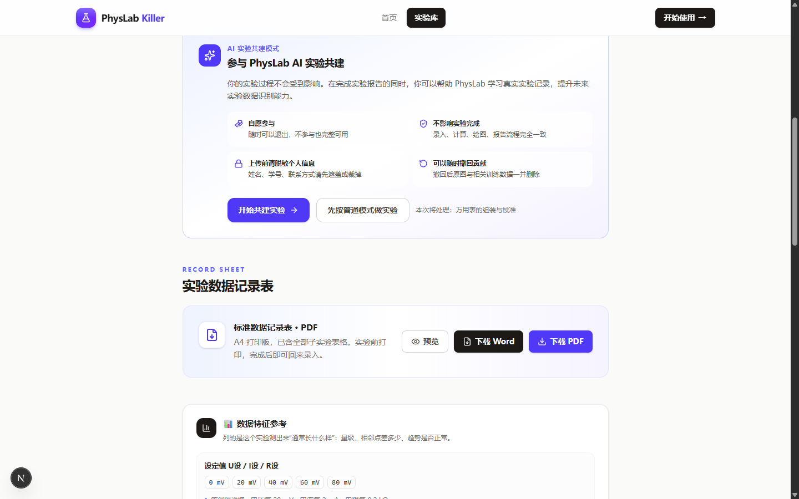
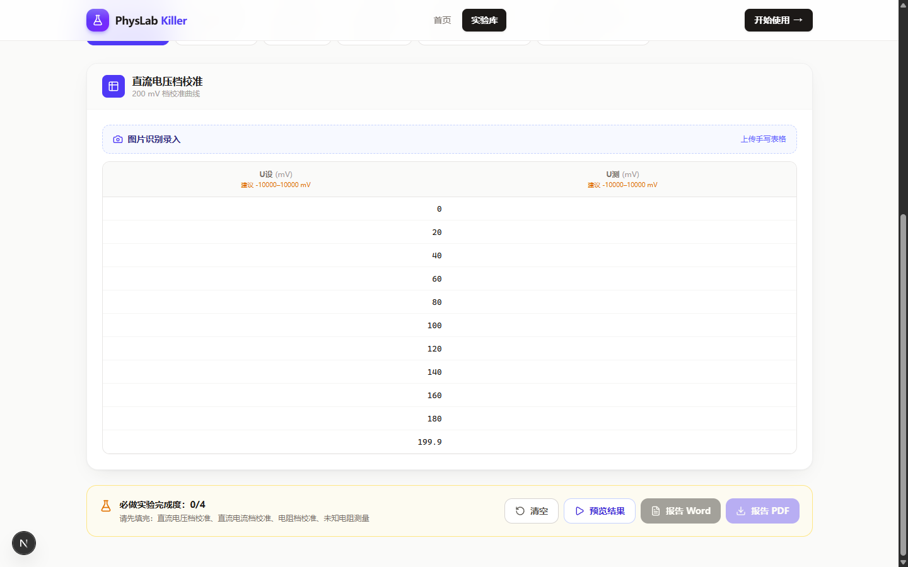

# PhysLab

### AI-powered Physics Laboratory Assistant

PhysLab 是一个面向大学物理实验的 AI 助手。它帮助学生完成实验数据处理的最后一公里：

- **实验数据录入** —— 手写记录表拍照上传，自动识别成数据
- **数据处理** —— 计算、误差分析、最小二乘拟合
- **曲线绘制** —— 结果图自动生成并按报告规范排版
- **实验报告** —— 一键导出含数据表、图像与计算结果的 Word / PDF

> PhysLab **不替代实验**。纸笔记录、动手操作、观察现象仍是实验课的核心；PhysLab 只是把实验之后的数据处理与出图变成一分钟的事。

**在线使用**：<https://bogger111.github.io/Physicallab/> · **问题反馈**：<https://github.com/Bogger111/Physicallab/issues>

---

## Features

### 📷 OCR 辅助实验数据录入

上传手写实验记录表的照片，PhysLab 会定位表格、切出每一个手写数值并给出识别候选。所有候选值都由你确认或修改后才进入计算。

### 📊 自动数据处理

- 数据计算：按每个实验的计算公式与单位自动处理
- 误差分析：相对误差、标准差、相关系数等
- 曲线绘制：验证性实验自动做最小二乘拟合与残差检查

### 📝 实验报告生成

一次导出即可得到：

- 数据表（含原始读数与计算结果）
- 结果图像（拟合曲线、特性曲线）
- 计算结果与误差分析

### 🤖 AI 实验共建

你可以自愿选择「AI 实验共建」模式，在**正常完成实验的同时**，帮助 PhysLab 学习真实实验记录，提升未来实验数据识别能力。

---

## 使用流程

```
1. 选择实验        2. 上传实验记录表     3. AI 辅助识别数据
        ↓                    ↓                     ↓
4. 检查并修改数据   5. 自动计算和绘图     6. 生成实验报告
```

| 步骤 | 说明 |
|---|---|
| 1. 选择实验 | 打开实验库，选择本次要做的实验（支持 12 个大学物理实验） |
| 2. 上传实验记录表 | 拍照或扫描手写记录表上传；也可以直接手动录入 |
| 3. AI 辅助识别数据 | 系统按实验模板切出每个数值并给出识别结果 |
| 4. 检查并修改数据 | 逐项确认；表格里可以直接改，超范围会给出提示 |
| 5. 自动计算和绘图 | 点击处理后自动完成计算、拟合与出图 |
| 6. 生成实验报告 | 下载 Word / PDF 报告，含数据表、图像与计算结果 |

<p align="center">
  
</p>

<table>
<tr>
<td width="50%"><br><sub>实验库：12 个大学物理实验</sub></td>
<td width="50%"><br><sub>工作台：数据录入、计算、绘图与报告</sub></td>
</tr>
</table>

## 支持的实验

| 分类 | 实验 |
|---|---|
| 光学 | 偏振光与双折射、迈克尔逊干涉实验 |
| 波动 | 声速光速的测量 |
| 电磁学 | 万用表的组装与校准、交直流电桥的原理及应用、太阳能电池特性、巨磁电阻效应及应用 |
| 近代物理 | 核磁共振实验、光电效应与弗兰克-赫兹实验 |
| 力学 | 落球法测液体粘滞系数、液体表面张力系数测量 |
| 热学 | 稳态法测固体导热系数 |

每个实验都配有标准记录表（可打印）、数据特征参考（这个实验的数据通常长什么样）与报告模板。

## AI 实验共建模式

AI 实验共建**不是额外任务**：它和普通实验走的是同一个工作台、同一套流程，区别只是实验结束后可以自愿贡献脱敏后的记录表。

```
选择共建模式 → 正常完成实验 → 确认数据 → 贡献脱敏实验记录 → 帮助优化 PhysLab
```

<p align="center">
  
</p>

- **完全自愿**：不参与也完整可用，随时可以切回普通模式
- **不影响正常实验**：录入、计算、绘图、报告流程完全一致
- **可以撤回贡献**：撤回后原图与由它生成的数据样本一并删除

## 数据安全

参与前请先删除或遮盖：**姓名、学号、联系方式**（以及人脸、证件等任何个人信息）。

系统会：

- 删除图片元数据：保存前重新编码，去掉拍摄时间、位置等照片信息
- 仅保存必要实验信息：只保留数值裁剪与最小必要的溯源信息
- 不公开用户实验记录：原始图片保存在私有存储中，不会进入公开仓库

<p align="center">
  
</p>

## 项目架构

```
User
 │
PhysLab（Next.js 界面 + FastAPI 服务）
 │
Experiment Processing（计算 · 误差分析 · 拟合绘图 · 报告）
 │
AI Data Pipeline（模板定位 · 表格切分 · 质量筛选）
 │
OCR Dataset（image, text）
 │
PhysLab_OCR（CRNN + CTC 识别模型训练）
```

PhysLab 负责采集与切分，[PhysLab_OCR](https://github.com/Bogger111/PhysLab_OCR) 负责数据集与模型训练——两个仓库职责分离。

## 开发状态

**当前（2.0）**

- 支持 12 个大学物理实验的录入、计算、绘图与报告
- 支持实验记录表 OCR 辅助录入（候选值须人工确认）
- 支持 AI 实验数据共建闭环：采集 → 确认 → 切分 → 训练集导出
- 后端 387 项、前端 44 项自动测试全部通过

**未来**

- 更多实验（力学、热学、电磁学、近代物理持续接入）
- 更强的 OCR 模型：用共建数据训练后的识别能力提升
- 更多智能实验辅助功能

> 验证边界：计算链、记录表、报告与 OCR 管线均已通过自动测试与合成数据验证；真实手写数据与真实实验读数的端到端验证仍在进行，发布版中的所有 OCR 候选值都需要人工确认。

## 本地运行（开发者）

```bash
# 后端
cd backend && pip install -r requirements.txt
uvicorn app.main:app --port 8001

# 前端
cd frontend && npm install && npm run dev
```

开发开关（可选，默认关闭数据共建）：`backend/.env.local`

```bash
ENABLE_DATA_COLLECTION=true     # 打开数据共建
PHYSICSLAB_DEV_MODE=true        # 打开开发者统计面板
```

更多细节见 [docs/physkiller-2.0.md](docs/physkiller-2.0.md)（架构与流水线）、[docs/screenshots.md](docs/screenshots.md)（截图清单）、[CHANGELOG.md](CHANGELOG.md)（发布说明）。

## 反馈

- 使用问题与建议：<https://github.com/Bogger111/Physicallab/issues>
- 数据共建相关疑问（授权、撤回、隐私）：同样通过 issue 联系

---

HUST 华中科技大学 · 大学物理实验
